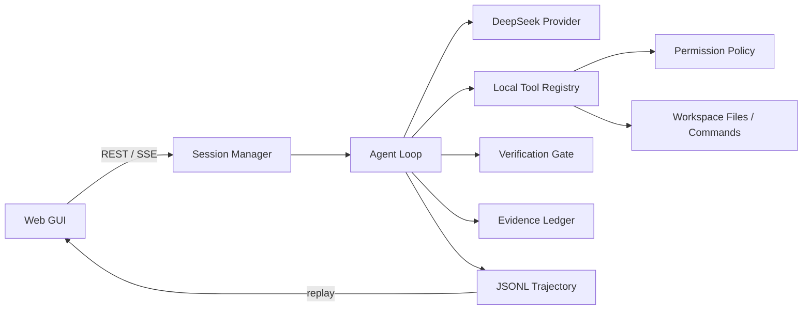

# BlueWhale Coding Agent

BlueWhale 是一个由 DeepSeek 驱动、证据优先（evidence-driven）的本地 Coding Agent。它不依赖 LangChain、LlamaIndex、OpenAI Agents SDK、AutoGen、CrewAI 等 Agent 框架，也不使用服务端托管的代码执行或文件工具；执行循环、权限策略、文件工具、验证门禁、轨迹存储和 Web GUI 均在仓库内自行实现。

项目面向“给定目标—检查代码—修改文件—运行验证—失败后修复—展示证据”的完整开发闭环。模型提出 Action，本地 Runtime 产生 Observation，最终结论必须由本地 diff、命令输出或测试结果支撑。

## 核心亮点

- **可回放执行轨迹**：每个事件按序写入 JSONL，SSE 断线后可通过 `Last-Event-ID` 继续回放。
- **证据账本**：模型文本不等于事实；文件变更、搜索结果和测试结果被转换为独立 Evidence。
- **验证—修复闭环**：自动发现项目声明的测试、类型检查和构建命令；失败后有限次请求模型修复，并检测无进展循环。
- **渐进式 Skills**：只向模型披露本地 Skill 的名称和描述，需要时再通过受控工具加载完整工作流。
- **本地安全边界**：所有路径限制在选定工作区内，危险命令直接拒绝，高风险操作通过 GUI 单次审批。
- **实时 Web GUI**：浏览器中查看会话、模型/工具事件、diff、验证证据和审批状态，无需 TUI。

## 架构



主要分层：

- `providers/`：将 OpenAI 兼容的 DeepSeek Chat Completions 转换为内部 `ModelResponse`。
- `agent/`：维护消息历史、步骤预算、终止条件和工具执行循环。
- `tools/`、`runtime/`：参数校验、路径约束、原子文件修改、命令执行和权限判定。
- `verification/`：发现验证命令，归一化结果，控制有限修复和无进展停止。
- `skills/`：发现、校验并按需加载项目级或用户级 `SKILL.md`。
- `evidence/`、`trajectory/`：生成可核验证据，并持久化可回放事件。
- `web/`：管理后台任务、审批 Future、REST/SSE API 和原生 HTML/CSS/JavaScript GUI。

## 环境要求与安装

- Python 3.12 或更高版本
- 一个 DeepSeek API Key

```bash
git clone https://github.com/Huatiancen/BlueWhale-Coding.git
cd BlueWhale-Coding
python -m venv .venv
source .venv/bin/activate
python -m pip install -e '.[dev]'
cp .env.example .env
```

Windows PowerShell 激活命令为：

```powershell
.venv\Scripts\Activate.ps1
```

## 配置 DeepSeek

编辑 `.env`：

```dotenv
DEEPSEEK_API_KEY=在此填写你自己的密钥
BLUEWHALE_MODEL=deepseek-v4-flash
BLUEWHALE_BASE_URL=https://api.deepseek.com
```

配置由 `pydantic-settings` 读取。API Key 使用 `SecretStr` 保存，不会被写入请求正文、事件轨迹或错误信息。`.env` 已被 Git 忽略，请勿提交真实凭据。

## 启动 macOS GUI

安装桌面依赖后启动原生应用窗口：

```bash
python -m pip install -e '.[desktop,dev]'
bluewhale desktop
```

首次使用时在首页配置 DeepSeek API Key，并通过系统目录选择器打开项目。API Key 保存于 macOS 钥匙串；项目历史、轨迹与诊断数据均保留在本机。桌面端会检查 API 配置、项目读写权限、Seatbelt 沙箱，以及当前项目需要的 Python、Node.js 或 C/C++ 工具链。

如需生成可从 Finder 启动的本机应用：

```bash
python scripts/build_macos_app.py
open dist/BlueWhale.app
```

构建脚本只使用 Python 标准库，不执行签名或公证，也不会覆盖已有的 `.app` 目录。生成的本机启动器优先使用当前仓库的 `.venv/bin/bluewhale`，因此适合在自己的 Mac 上演示。

## 启动 Web GUI

```bash
bluewhale serve --workspace /absolute/path/to/your/project
```

默认仅监听本机 `127.0.0.1:8000`。浏览器打开：

```text
http://127.0.0.1:8000
```

也可以指定端口：

```bash
bluewhale serve --workspace . --host 127.0.0.1 --port 8765
```

在 GUI 中输入开发目标后，BlueWhale 会实时展示 PLAN、MODEL、TOOL、EDIT、TEST、ERROR 和 DONE 事件。覆盖文件、安装依赖、网络请求或 Git 写操作等 ASK 类行为必须由用户批准一次；拒绝、超时或停止都不会执行该操作。

## 安全边界

- 文件访问必须位于 `--workspace` 指定目录内，拒绝路径穿越和越界符号链接。
- `.git`、`.env*` 和 `.bluewhale` 被视为受保护路径。
- `rm`、`sudo`、`git reset` 等危险或破坏性命令不会静默执行，必须进入显式审批；系统仍会拒绝无法安全限定目标的请求。
- 已知只读工具和常见测试命令可自动执行；未知命令默认请求审批。
- 审批仅对当前 Action 生效，不能重复使用；默认 60 秒超时并按拒绝处理。
- 命令具有超时限制，Agent 具有步骤数、修复次数和总运行时间预算。

## 本地 Skills

BlueWhale 采用与 Pi 类似的渐进式披露方式：启动任务时只把 Skill 名称、描述和作用域放入模型上下文；DeepSeek 判断任务匹配后调用只读的 `load_skill` 工具，完整 `SKILL.md` 才会进入后续上下文，不需要额外的路由 API 请求。

支持以下位置：

```text
~/.bluewhale/skills/<name>/SKILL.md
~/.agents/skills/<name>/SKILL.md
<workspace>/.bluewhale/skills/<name>/SKILL.md
<workspace>/.agents/skills/<name>/SKILL.md
```

项目级同名 Skill 覆盖用户级 Skill。最小文件格式为：

```markdown
---
name: python-testing
description: Discover and run Python tests. Use for pytest or unittest work.
---

# Python Testing

Run the narrowest relevant tests before the full suite.
```

用户可以输入 `/skill:python-testing 检查当前测试` 强制加载指定 Skill。设置 `disable-model-invocation: true` 后，该 Skill 不会出现在模型可自动选择的目录中，但仍可通过 `/skill:name` 显式调用。

Skill 下可以包含 `scripts/`、`references/` 和 `assets/`。BlueWhale 只提供安全的相对资源清单，不会因加载 Skill 自动运行脚本。任何后续文件访问、命令执行、联网或高风险操作仍由原有工作区边界、沙箱和审批策略判断；Skill 不能覆盖这些安全规则。

## 本地数据

每次运行会在目标工作区创建：

```text
.bluewhale/runs/<run-id>/events.jsonl
```

轨迹是追加写入的结构化事件，用于 GUI 回放和审计。写入前会递归脱敏常见密钥、令牌和认证字段。该目录已在本仓库的 `.gitignore` 中忽略；对其他目标项目使用时，也建议将 `.bluewhale/` 加入其忽略规则。

桌面端支持导出脱敏诊断 ZIP。诊断包只包含 BlueWhale 版本、平台、自检摘要、最近任务状态、事件类型计数与验证结果，不包含 `.env`、API Key、完整环境变量、任务正文、模型回答或项目源代码。

## 本地演示项目

选择 `demo/bluewhale-repair-demo` 可演示缺陷定位、文件修改、独立验证、Diff 和按文件撤销。推荐指令与预期验证命令见该目录内的 `验证指令.md`；项目初始测试被有意设计为失败。

## 测试

运行全部离线测试：

```bash
python -m pytest -q
python -m ruff check src tests
python -m mypy src
```

`tests/fixtures/sample_project` 是故意包含除零错误的演示素材，因此不会被常规测试递归收集。集成测试会将它复制到临时目录，并覆盖“首次修复通过”和“验证失败后自动修复”两条工作流。

真实 DeepSeek 契约测试默认跳过，不会访问网络或产生费用。只有同时显式设置开关和密钥时才会运行：

```bash
BLUEWHALE_RUN_LIVE_TESTS=1 \
DEEPSEEK_API_KEY=你的密钥 \
python -m pytest tests/integration/test_deepseek_contract.py -q
```

这些测试验证普通回答、原生 tool calling，以及 thinking tool call 后续轮次对 `reasoning_content` 的回传。

## 终止结果

BlueWhale 使用稳定的停止原因区分完成、部分验证、用户停止、步骤/时间限制、权限拒绝、API 错误、协议错误、工具错误、验证失败和无进展。GUI 的“已完成”并不隐含“验证通过”，应同时查看 `verified` 状态和 Evidence 面板。

## License

本项目使用仓库内 [LICENSE](LICENSE) 所述许可证。
